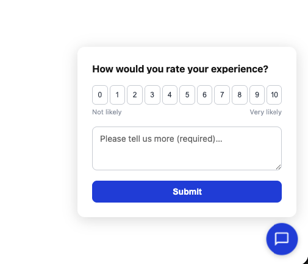
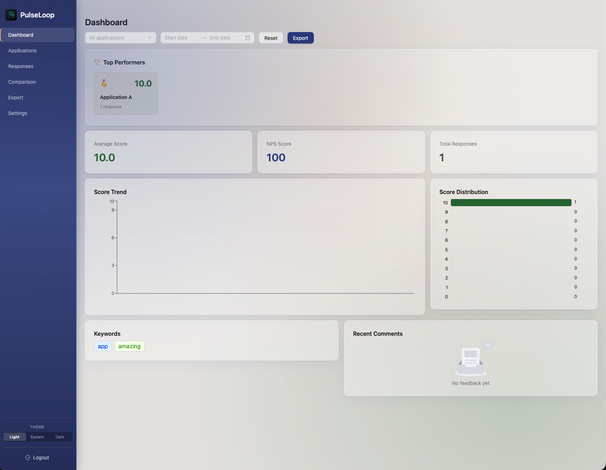
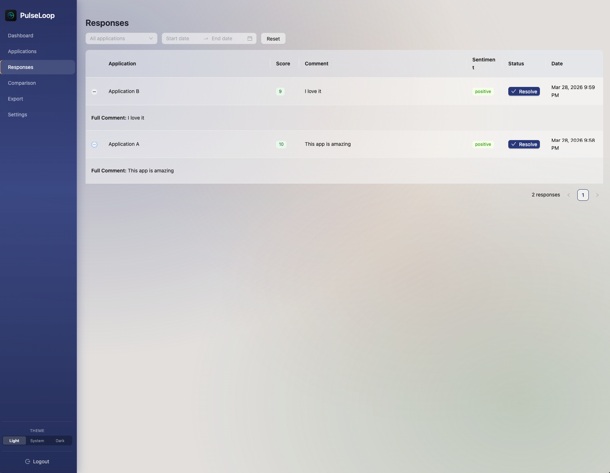
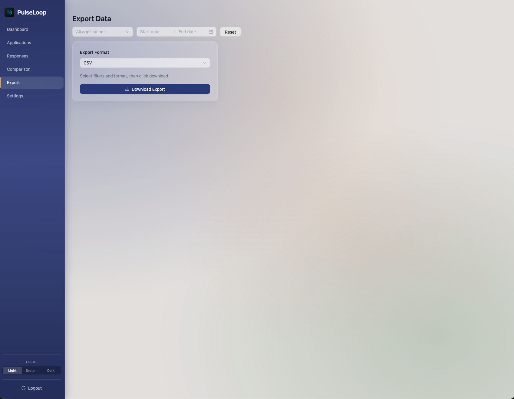

# PulseLoop

A self-hosted feedback analytics platform. Collect NPS-style feedback from your applications via an embeddable widget, and analyze responses through a rich dashboard with filtering, sentiment analysis, and cross-app comparison.

## Features

### Core
- **Embeddable Widget** — Lightweight JS plugin (~8KB gzipped) with floating button or inline embed modes. Shadow DOM for style isolation.
- **NPS Analytics** — Average score, NPS calculation, score distribution, trends over time.
- **Sentiment Analysis** — Automatic positive/negative/neutral classification using AFINN lexicon.
- **Word Cloud** — TF-IDF keyword extraction from feedback comments.
- **Cross-App Comparison** — Compare metrics across multiple registered applications.
- **Top Performers** — Dashboard ranking of apps by average score with medals.
- **Export** — CSV and JSON export with date and application filters.

### Feedback Loop (Phase 2a)
- **Feedback Tagging** — Tag feedback entries with categories (e.g., "performance", "bug", "onboarding"). Add/remove tags directly from the Responses table.
- **Action Items** — Create action items tied to tags. Track completion with checkboxes. Manage from the Application Detail page.
- **NPS Alerts** — Configure per-app Slack webhook alerts. Daily cron checks 7-day rolling NPS. Fires when NPS drops below your threshold.
- **Resolve/Archive** — Mark feedback as resolved with a single click. Auto-archive entries older than 12 months via `POST /api/feedback/archive-old`.
- **Weekly Digest** — Auto-generated "You Said, We Did" summary page per application. Shows weekly scores, top tags, completed action items, and recent comments. Shareable URL at `/api/digest/:appId/latest`. Weekly cron + on-demand generation.

### Platform
- **App Metadata** — Add a URL and icon to each application. Icon stored as base64 in the database (no file storage needed). App name links to the URL on the Applications page.
- **Responsive Design** — Sidebar collapses on mobile with a burger menu button. Overlay dismisses sidebar on tap.
- **Dark Mode** — System/Light/Dark theme toggle with glassmorphism UI. Full coverage for all Ant Design components including dropdowns, popovers, and date pickers.
- **PulseLoop Self-Feedback** — Built-in system app for rating PulseLoop itself. Uses app branding, visible to all users.
- **Real-Time NPS Alerts** — Threshold alerts fire on every feedback submission (not just daily cron). Manual trigger via `POST /api/alerts/check`.
- **Password Policy** — Passwords require letters, numbers, and special characters.
- **Password Management** — Change password from the Settings page with current password verification.
- **Self-Hosted** — Single `docker compose up` deploys everything. No external dependencies.
- **Design System** — Documented in [DESIGN.md](DESIGN.md): color palette, spacing scale, component patterns, dark mode rules, accessibility guidelines.

## Tech Stack

| Layer | Technology |
|-------|-----------|
| Backend | NestJS, TypeORM, PostgreSQL 16 |
| Frontend | React 18, Ant Design 5, Recharts, TanStack Query |
| Widget | Vanilla TypeScript, Shadow DOM, Vite IIFE build |
| Infrastructure | Docker Compose, nginx |

## Quick Start

### Prerequisites

- [Docker](https://docs.docker.com/get-docker/) and Docker Compose

### Deploy

```bash
git clone https://github.com/nikola-kovacevic/feedback.git
cd feedback
cp .env.example .env
```

Edit `.env` and set a secure `JWT_SECRET`:

```
JWT_SECRET=your-secure-random-string-here
```

Start the application:

```bash
docker compose up --build -d
```

Open [http://localhost](http://localhost) in your browser.

### Default Ports

| Service | Port |
|---------|------|
| Frontend (nginx) | 80 |
| Backend API | 3000 |
| PostgreSQL | 5432 |

## Local Development

### Prerequisites

- Node.js 20+
- pnpm (`corepack enable`)
- PostgreSQL running locally

### Setup

```bash
pnpm install
cp .env.example .env
# Edit .env: set DATABASE_URL to your local PostgreSQL
# Edit .env: set JWT_SECRET to any string for dev
```

### Run

```bash
# Terminal 1: Backend
pnpm dev:backend

# Terminal 2: Frontend
pnpm dev:frontend

# Terminal 3: Widget (optional, for widget development)
pnpm dev:widget
```

Frontend runs at [http://localhost:5173](http://localhost:5173) with API proxy to the backend.

## Widget Integration

After registering an application in the dashboard, embed the widget in your app:

### Floating Mode

```html
<script src="http://your-pulseloop-server:3000/widget/feedback.js"></script>
<script>
  FeedbackWidget.init({
    apiKey: 'your-api-key',
  });
</script>
```

### Inline Mode

```html
<div id="feedback-container"></div>
<script src="http://your-pulseloop-server:3000/widget/feedback.js"></script>
<script>
  FeedbackWidget.render({
    apiKey: 'your-api-key',
    target: '#feedback-container',
  });
</script>
```

### User Context (Optional)

Pass user metadata to associate feedback with specific users:

```javascript
FeedbackWidget.init({
  apiKey: 'your-api-key',
  user: { id: '123', email: 'user@example.com', role: 'admin' },
});
```

## API Documentation

Swagger UI is available at [http://localhost:3000/api/docs](http://localhost:3000/api/docs) when the backend is running.

## Testing

```bash
# Start the app first (Docker or local dev)
# Then run e2e tests against the running server:
cd packages/backend
BASE_URL=http://localhost:3000 npx jest --config ./test/jest-e2e.json --forceExit --runInBand
```

65 e2e tests covering: auth (register, login, refresh, password change), applications CRUD, widget API, feedback submission + tagging + resolve, action items CRUD, alert config, analytics (6 endpoints), export (CSV + JSON), weekly digest (generate, data, HTML, 404), multi-user isolation, and input validation.

## Project Structure

```
pulseloop/
├── packages/
│   ├── backend/       # NestJS API server
│   ├── frontend/      # React dashboard SPA
│   └── widget/        # Embeddable JS plugin
├── docker-compose.yml
├── .env.example
└── pnpm-workspace.yaml
```

## Environment Variables

| Variable | Default | Description |
|----------|---------|-------------|
| `POSTGRES_DB` | feedback | Database name |
| `POSTGRES_USER` | feedback | Database user |
| `POSTGRES_PASSWORD` | changeme | Database password |
| `DATABASE_URL` | — | PostgreSQL connection string |
| `JWT_SECRET` | — | **Required.** Secret for signing JWTs |
| `JWT_EXPIRES_IN` | 15m | Access token expiry |
| `CORS_ORIGIN` | http://localhost | Allowed origins for dashboard |
| `BACKEND_URL` | http://localhost:3000 | Backend URL for embed snippets |
| `TYPEORM_SYNC` | false | Set to `true` to auto-sync schema (dev only) |

## Screenshots





## License

[MIT](LICENSE)
